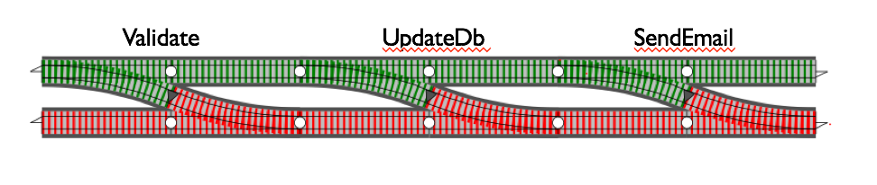

# Functional & Railway Oriented Programming

## A practical dive into composable pipelines

<!--
Welcome everyone.

Today we’re looking at how to build software in a cleaner, more predictable way using functional pipelines and Railway Oriented Programming.

The focus isn't on math-heavy FP—it's on practical patterns that make everyday code easier to write, debug, and extend.
-->

---

## **Exploring comopsable workflows (pipelines) using FP and ROP**

### The usual way

How things are usually done

#### **The Imperative Approach (Before)**

```python
def process_username_imperative(raw_name):
    # Mutation 1: The variable changes state
    name = raw_name.strip()
    
    # Mutation 2: The variable changes state again
    name = name.lower() 

    # Explicit branching and error checking
    if len(name) < 5:
        return f"ERROR: '{name}' is too short."

    return name.replace(" ", "_")

print(process_username_imperative("  Alice Smith  ")) 
# Output: alice_smith
```

<!--
Let’s start with the most familiar approach: imperative programming.

This is how many of us write code by default—update variables step-by-step, check errors manually.

It's simple but tends to grow messy as logic expands.
-->

---

### A different way

Trying a composable workflow pipeline

#### **The Functional Pipeline**

```python
# --- A. Simple, Pure Functions ---
def strip_name(name): return name.strip() 
def to_lowercase(name): return name.lower()
def replace_spaces(name): return name.replace(" ", "_")

# --- B. The Pipeline Tool ---
def pipe(data, *functions):
    result = data
    for func in functions:
        result = func(result) # New result is created at each step
    return result

# --- C. The Execution ---
raw_input = "  Alice Smith  "

final_user = pipe(
    raw_input,
    strip_name,     # Data -> Output 1
    to_lowercase,   # Output 1 -> Output 2
    replace_spaces  # Output 2 -> Final Result
)

# Result:
print(final_user)
# Output: alice_smith
```

<!--
Instead of mutating state, functional programming encourages building small, single-purpose functions.

Then we create a reusable pipeline tool that pushes data through those steps.

Each step returns new data—no mutation, no hidden behavior.

The pipeline becomes easy to read and test.
-->

---

### Ultimately

Handling errors and expectations with Result moands

#### **The result monad**

```python
# Assuming the Result class (with .bind, .success, .failure) is defined

def strip_name(name): return Result.success(name.strip()) 
def to_lowercase(name): return Result.success(name.lower())
def replace_spaces(name): return Result.success(name.replace(" ", "_"))

raw_input = "  Al  " # Fails validation

final_outcome = (
    Result.success(raw_input) # Start on the success track
    .bind(strip_name)
    .bind(to_lowercase)
    .bind(validate_min_len)    # FAILURE occurs here! Switches to error track.
    .bind(replace_spaces)      # SKIPPED automatically by .bind()
)

if final_outcome.is_success:
    print(f"Success: {final_outcome.value}")
else:
    print(f"Error: {final_outcome.error}")
# Output: Error:  Name 'al' too short.
```

<!--
Now we address a limitation in simple pipelines: error handling.

What if one step fails? In imperative code, you handle it everywhere.

Functional pipelines use a Result type to represent “success” or “failure.”

.bind() runs the next function only if the previous succeeded—creating automatic flow control.
-->

---

## **The Landscape of Paradigms**

### 1. **Imperative** (The "How")

Changing state step-by-step.

* **Procedural:** Lists of instructions.
* **Object-Oriented (OOP):** Encapsulating state in objects.

<br/>

### 2. **Declarative** (The "What")

Describing the desired result.

* **Functional (FP):** Composing pure mathematical functions.
* **Logic:** Defining rules and facts (e.g., Prolog).

<br/>

### 3. **Reactive** (The "When")

Responding to data streams/propagation of change.

<!--
Quick high-level comparison of programming paradigms.

Imperative = “How do I do it?”

Declarative = “What should happen?”

Reactive = “When something happens, how do I respond?”

FP and ROP live in the declarative world—focused on describing transformations, not orchestrating control flow.
-->

---

## **Imperative vs. Declarative**

### Imperative (The "How" - Explicit Steps)

The focus is on explicitly defining the sequence of operations that mutate state or define structure.

#### 1. Procedural / Looping (State Mutation)

You instruct the machine to **start at 0** and perform addition repeatedly.

```python
total = 0
for i in range(1, 6):
    total += i  # State (total) is changed explicitly in each step
print(total) 
```

<!--
Imperative programming relies on explicit steps and mutable state.

These examples show how you tell the machine exactly what to do.

Great for low-level control, but can become verbose and error-prone for complex logic.
-->

---

#### 2. Object-Oriented (OOP)

You define the **HOW** the internal data changes via methods.

```python
class BankAccount:
    def __init__(self, balance=0):
        self.balance = balance
    def deposit(self, amount):
        self.balance += amount # Explicitly changing internal state
```

<!--
OOP still follows imperative patterns—methods change object state.

This works well for real-world modeling but can mix responsibilities and hide state mutation.
-->

---

## **Declarative (The "What" - Desired Result)**

The focus is on describing the desired goal or end state. The underlying system figures out the *how*.

### 1. Functional Programming

You state the **WHAT** (cumulative addition) using a Higher-Order Function.

```python
def square(number):
    return number * number

original_numbers = [2, 3, 4]
squared_numbers = list(map(square, original_numbers)) 

print(f"Original list: {original_numbers}") # Output: [2, 3, 4] (Unchanged!)
print(f"Squared list:  {squared_numbers}")  # Output: [4, 9, 16]
```

<!--
Declarative approaches shift the focus.

Instead of looping, we describe what we want: “Square these numbers.”

The system handles the iteration.

Data stays immutable, making reasoning far easier.
-->

---

### 2. Defining Infrastructure

You define the **WHAT** the environment should look like.

```yaml
services:
  web:
    build: .
  db:
    image: postgres:14
```

<!--
Declarative patterns appear outside code too—like Docker Compose or Terraform.

You describe the desired end-state, not the steps to build it.
-->

---

## **Reactive & Event-Driven (The "When")**

The program structure is determined by **events** and external triggers. The code doesn't run top-to-bottom; it **waits** for signals.

### 1. Simple Event-Driven (Vanilla JavaScript)

*The **"One-to-One" Model**: An action triggers a single immediate response.*

```javascript
const button = document.getElementById('save-btn');
let status = 'ready';

// The function is executed *only* when the 'click' event occurs.
button.addEventListener('click', (event) => {
    status = 'saving...';
    // Logic runs here in response to the user's signal.
});
```

<!--
FP is about writing software using pure functions.

No mutation, no side effects.

Why? Because these constraints make code predictable, testable, and composable.
-->

---

## Functional Programming

What is Functional Programming?

FP is a paradigm that treats computation as the evaluation of mathematical functions, avoiding mutable data and changing state.

### The Core: Purity

FP is about building software with **Pure Functions**, which are the simplest, most predictable building blocks possible.

### What makes a function "Pure"?

<!--
A pure function always gives the same output for the same input.

If a function depends on something external and mutable, it becomes unpredictable.

Determinism gives you reliability.
-->

---

### 1. **Deterministic**

* **Definition:** Same Input $\rightarrow$ Always Same Output.
* **Rule:** The function cannot rely on any external state that might change (like system time, global variables, or network calls).

--

### **Why Determinism Matters?**

The "why" is **Reliability and Testability**. Determinism guarantees **reliability**.

| **Pure Example** (`check_length`) | **Impure Example** (`check_length`) | **Why the Impurity?** |
| :--- | :--- | :--- |
| `MIN = 5 def check(t):     return len(t) >= MIN` | `GLOBAL_MIN = 5 def check(t):     return len(t) >= GLOBAL_MIN` | The output depends on a **mutable external state** (`GLOBAL_MIN`). If another part of the program changes `GLOBAL_MIN = 10`, the result is unreliable. |

<!--
The table shows how even a small dependency on global state makes a function impure.

Pure functions are easier to test and reason about because nothing "from the outside" changes their behavior.
-->

---

### 2. **No Side Effects**

* **Definition:** No printing, no DB writes, no global variable changes *inside* the function.
* **Rule:** The function must not cause any observable change to the outside world, beyond returning its value.

--

### **Why No Side Effects Matters?**

The "why" is **Predictability and Parallelism**. Eliminating side effects is key to **predictability**.

| **Pure Example** (`check_length`) | **Impure Example** (`check_length`) | **Why the Impurity?** |
| :--- | :--- | :--- |
| `def check(t):     return len(t) >= 5` | `def check(t):     if len(t) < 5:         print(f"Error: {t} failed.")     return len(t) >= 5` | Logging/Printing is **I/O**. The function has caused an externally observable change (the console output). Error notification should happen **after** the pure function returns the failure state. |

<!--
Pure functions should not cause any external observable effects—no DB writes, no printing.

Side effects make functions harder to test and reuse.

- Why No Side Effects Matters

The impure example prints logs, which means calling the function has external consequences.

Pure functions return data; another part of the system decides what to do with that data.
-->

---

## **The Toolkit: Building Composable Workflows**

The ultimate goal of using these tools is to build Composable Workflows—reliable, linear pipelines where data flows smoothly from start to finish.

### **"Do One Thing, And Do It Well"**

**Bad Example** (Mixed Responsibilities)
*This function strips, lowercases, AND validates\!*

```py
def clean_and_validate(name):
    cleaned = name.strip().lower()
    if len(cleaned) < 5:
        raise ValueError("Too short")
     return cleaned
```

**Good Example** (Single Responsibility)
*Each function does only one job.*

```py
def strip_name(name):
    return name.strip()

def to_lowercase(name):
    return name.lower()

def check_length(name):
    return len(name) >= 5
```

<!--
To build pipelines, each function must do one job well.

When functions mix responsibilities, composition becomes impossible.

The goal is predictability through small, focused functions.
-->

---

### **Arity (Argument Count)**

**The Lego Brick Rule:** To snap functions together, shapes must match.

* **Unary (1 argument):** The gold standard for pipelines. `Output A -> Input B`.
* **Binary (2+ arguments):** Hard to chain directly.

--

#### **Why Arity Matters (The Need for Unary Functions)?**

The "why" is **Seamless Composition**. A functional pipeline's core mechanism requires the **single output** of one function to connect perfectly as the **single input** of the next function.

**Example:**

* **Works:** `name.strip()` $\rightarrow$ `name.lower()`
* **Fails:** `name.strip()` $\rightarrow$ `check_length(name, min_len)` (Needs `min_len` input).

<!--
Pipelines rely on consistent shapes: one input → one output.

Multi-argument functions break that chain.

Unary functions are the fundamental building blocks of functional composition.
-->

---

### **Currying**

* The technique of converting a multi-argument function into a sequence of unary functions.

```python
def check_length(min_len, text):
    return len(text) >= min_len

def set_min_len_attribute(required_length, checker_func):
    def validated_input_checker(text_input):
        return checker_func(required_length, text_input)
    return validated_input_checker

validate_min_length_5 = set_min_len_attribute(5, min_len_checker)

print(f"Is 'Alice' valid? {validate_min_length('Alice')}") 
print(f"Is 'Bob' valid?   {validate_min_length('Bob')}")
```

--

#### **Why curry/partial?**

Currying is the essential tool that gives us **Adaptability and Control**, allowing functions that need extra context to still work in a simple, linear pipeline

<!--
Currying converts multi-argument functions into unary functions.

This makes them compatible with pipelines.

It also allows configuration—like setting a minimum length once, then reusing that pre-configured validator.
-->

---

| Concept | What It Does (Simplified) | Why It's Necessary for Pipelines |
| :--- | :--- | :--- |
| **Pre-Configuration** | It takes a multi-input function and **locks in** a required setting (like fixing a tax rate or setting the minimum length to 5). | It lets you **reuse complex logic** in different contexts without rewriting the function. |
| **Standardization** | It transforms the function into the required **Unary Shape** (1 input argument). | It ensures **guaranteed data flow**. Every function now follows the **Lego Brick Rule**—one output connects perfectly to the next input. |

**Simply Put:** Currying gives your pipeline control over external settings, making multi-argument functions behave like simple, predictable building blocks.

#### **Why Currying / Partial Application Matters**

The "why" is **Adaptability and Flexibility**. Currying is the tool used to fix the "shape mismatch" caused by binary functions, allowing them to participate in the pipeline.

<!--
Currying gives flexibility and reusability.

It standardizes the function shape without removing configurability.

Pipelines need consistent shapes—currying delivers that.
-->

---

## **The Goal: Composition**

**Building Pipelines**
We want to flow data through small, logical steps.

$$Data \rightarrow f(x) \rightarrow g(x) \rightarrow Result$$

```python
# The "Manual" Way (Hard to read)
result = square(add5(10))

# The "Pipeline" Way (Conceptual)
# 10 | add5 | square
```

> **The Problem:** What happens if `add5` fails or returns an error? The pipeline crashes.

<!--
The goal is to write code as a sequence of transformations.

But real-world functions can fail, which breaks naive pipelines.

We need a way to build pipelines that survive errors gracefully.
-->

---

## **The Error Handling Nightmare**

**Traditional Imperative Approach**
Checking for errors at every single step (The "Pyramid of Doom").

```python
def process_data(user_id):
    # Step 1: Get User
    try:
        user = get_user(user_id)
    except AppError as e:
        # Explicit error handling after the first step
        return None, f"Error (User): {e}"

    # Step 2: Get Email
    try:
        email = get_email(user)
    except AppError as e:
        # Explicit error handling after the second step
        return None, f"Error (Email): {e}"

    # Step 3: Format Data
    try:
        formatted = format_email(email)
    except AppError as e:
        # Explicit error handling after the final step
        return None, f"Error (Format): {e}"

    # Success: Return the final value
    return formatted, None
```

*This hides the business logic behind error checking.*

<!--
Traditional error handling leads to deeply nested try/except or if/else blocks.

This hides core business logic.

The structure becomes difficult to maintain and reason about.
-->

---

## **Solution: Railway Oriented Programming (ROP)**

**Visualizing the Flow**
Imagine two parallel tracks.

1. **Green Track (Success):** Data flows happily to the next function.
2. **Red Track (Failure):** If an error occurs, we switch tracks. The error bypasses all remaining functions.



*image ref: <https://zohaib.me/railway-programming-pattern-in-elixir/>*

<!--
ROP solves the error-handling problem using two tracks: success and failure.

As soon as one step fails, the pipeline switches tracks.

No more manual branching—error flow is unified and predictable.
-->

---

## **The Mechanism: The "Result" Monad**

A "Monad" is just a **smart box** around your data.

```python
class Result:
    def __init__(self, value, is_success, error=None):
        self.value = value
        self.is_success = is_success
        self.error = error

    @classmethod
    def success(cls, v): return cls(v, True)
    
    @classmethod
    def failure(cls, e): return cls(None, False, e)

    # The Magic Switch (.bind)
    def bind(self, func):
        if self.is_success:
            return func(self.value) # Run next step
        else:
            return self             # Skip step, pass error along
```

<!--
The Result type holds either a success value or an error.

.bind() is the key:

If success → run next function

If failure → skip remaining functions

This encapsulates both data and flow control.
-->

---

## **ROP in Action (The Clean Pipeline)**

Notice: No `if/else` statements in the main logic\!

```python
# 1. Define Unary Steps that return Results
def validate(name):
    if len(name) > 2: return Result.success(name)
    return Result.failure("Name too short")

def upper_case(name):
    return Result.success(name.upper())

def greet(name):
    return Result.success(f"Hello, {name}!")

# 2. Run the Pipeline
outcome = (
    Result.success("bo")      # Start with data
    .bind(validate)           # Fails here! Switch to Red Track.
    .bind(upper_case)         # Skipped
    .bind(greet)              # Skipped
)

print(outcome.error) # Output: "Name too short"
```

<!--
This is ROP applied to a real pipeline.

Validation fails early, and the rest of the pipeline is skipped automatically.

The business logic stays clean and declarative.
-->

---

## **Q\&A**

**Thank You\!**

* **Imperative:** How to do it.
* **Declarative:** What to do.
* **ROP:** How to handle errors without breaking the flow.

<!--
Wrap up by summarizing:

Imperative shows how.

Declarative shows what.

ROP ensures safe, predictable flow with minimal branching.

Invite questions.
-->
